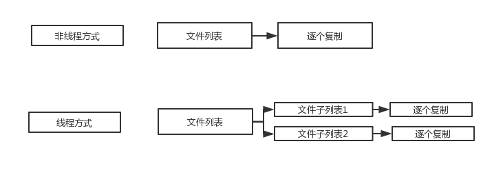

前后的差异


关于synchronize的问题

问题1.
```java
public class SynchronizedDemo implements Runnable{
    int x = 100;

    public synchronized void m1() {
        x = 1000;
        try {
            Thread.sleep(1000);
        } catch (InterruptedException e) {
            e.printStackTrace();
        }
        System.out.println("x=" + x);
    }

    public synchronized void m2() {
        try {
            Thread.sleep(200);
        } catch (InterruptedException e) {
            e.printStackTrace();
        }
        x = 2000;
    }
    public static void main(String[] args) throws InterruptedException {
        SynchronizedDemo sd = new SynchronizedDemo();
        new Thread(()->sd.m1()).start();
        new Thread(()->sd.m2()).start();
        sd.m2();
        System.out.println("Main x=" + sd.x);
    }

    /*
    my answer
    Main x=2000
    x=1000
     */
    @Override
    public void run() {
        m1();
    }
```
输出结果

      Main x=2000
      x=1000

原因：

    main方法中创建了SynchronizedDemo对象，并且分别创建了两个线程t1,t2，这个两个线程分别执行SynchronizedDemo对象方法m1 m2,并启动线程，然后再main方法中执行方法m2.
    由于线程t1会休眠1000毫秒，线程t2休眠200毫秒，多以在main方法调用方法m2时，t1 t2都是出于休眠状态，所以main方法优先拿到锁并执行方法m2,打印语句'Main x=2000'然后释放锁。
    而线程t2的休眠时间比线程t1的休眠时间段，线程t1会先拿到锁执行方法m2然后释放锁
    最后线程t1拿到锁，执行方法m1，打印语句'x=1000'，然后释放锁

问题2.

```java
public class SynchronizedDemo2  {
    static Integer count=0;
    public static void incr(){
        synchronized (count) {
            try {
                Thread.sleep(1);
            } catch (InterruptedException e) {
                e.printStackTrace();
            }
            count++;
        }
    }
    public static void main(String[] args) throws IOException, InterruptedException {
        for(int i=0;i<1000;i++){
            new Thread(()->SynchronizedDemo2.incr()).start();
        }
        Thread.sleep(5000);
        System.out.println("result:"+count);
    }
}
```

答案：

    输出的数值肯定小于1000
    
原因：
   
    锁需要满足两个条件，一是存在多个线程共享，而是在同一时刻互斥，这里的锁对象是类常量count，属于跨对象的锁，当类完成加载，count=0. 对应一个具体的内存地址。所有的线程对这个地址进行共享和互斥。
    但是
    当第一个线程拿到锁后，执行方法incr()，会执行count++操作，拆分为count=count+1.
    这个时候会调用Integer.valueOf()方法
    方法会判断增加之后的值是否处于-128到127，如果不满足，会重新new一个新的Integer对象，一个新的内存地址指向它，不再是原来的那个对象;
    如果满足条件，会从cache数组中从新获取，但cache中的每一个值也是通过new Integer的方式创建，所以仍然不是原来那个对象。
    当执行完incr()方法后，原来的锁对象已失效。而是指向新的Integer对象。
```java
 public static Integer valueOf(int i) {
        if (i >= IntegerCache.low && i <= IntegerCache.high)
            return IntegerCache.cache[i + (-IntegerCache.low)];
        return new Integer(i);
    }
```
```java
for(int k = 0; k < cache.length; k++)
    cache[k] = new Integer(j++);
```