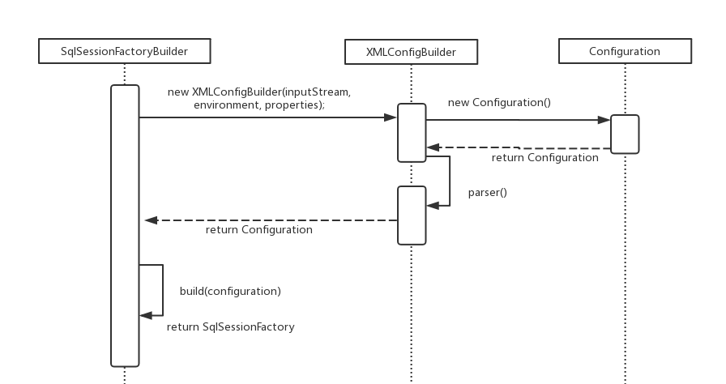
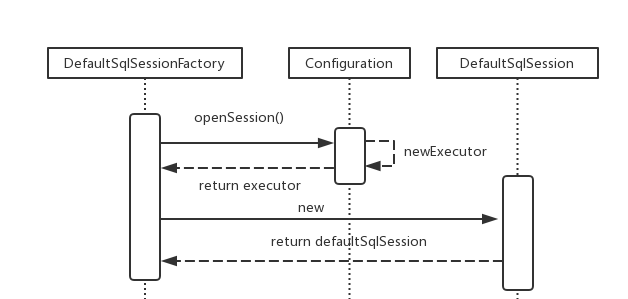
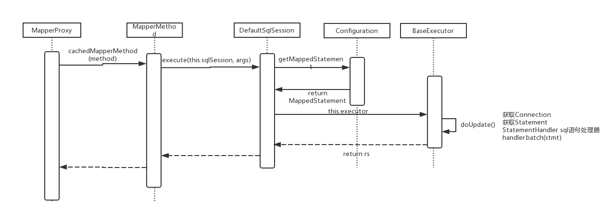

#### 跟踪update()流程，绘制每一步的时序图（4个）
`1.创建SqlSessionFactory`

`2.获取SqlSession`

`3.getMapper`

`4.执行Update语句`

#### 总结：MyBatis里面用到了哪些设计模式？

设计模式|具体体现
---|---
简单工厂模式 | SqlSessionFactoryBuilder 
工厂方法模式 |SqlSessionFactory.openSession() 
代理模式|sqlSession.getMapper()
装饰器模式|executor = new CachingExecutor((Executor)executor)

