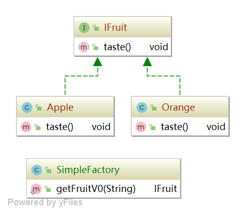
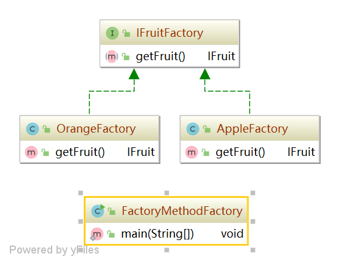
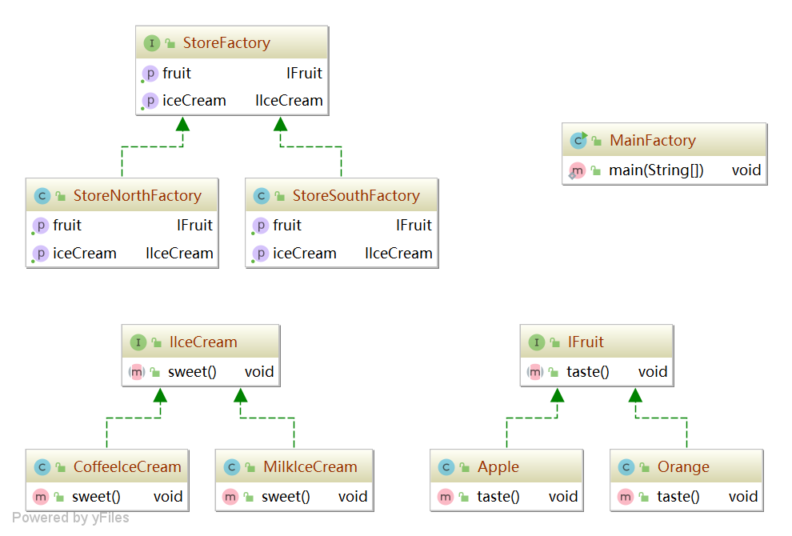

# 工厂模式


---


工厂模式在我看来就是创建对象的模式，根据大家的使用习惯一般分为了三种，简单工厂模式，工厂方法模式，和抽象工厂模式。
### 简单工厂模式
代码实现
```java
public  static IFruit getFruitV0(String name) {
        IFruit fruit = null;
        if("Apple".equals(name)){
            fruit = new Apple();
        }else if("Orange".equals(name)){
            fruit = new Orange();
        }

        return fruit;
    }
```


### 工厂方法模式
```java
public static void main(String[] args) {
        IFruitFactory factory = new AppleFactory();
        IFruit fruit = factory.getFruit();
        fruit.taste();

        factory = new OrangeFactory();
        fruit = factory.getFruit();
        fruit.taste();
    }
```


### 抽象工厂模式
```java
public static void main(String[] args) {
        StoreFactory factory = new StoreNorthFactory();
        factory.getFruit().taste();
        factory.getIceCream().sweet();

        factory = new StoreSouthFactory();
        factory.getFruit().taste();
        factory.getIceCream().sweet();
    }
```

> 如果我们只有一个产品，用简单工厂或者工厂方法

### 总结
形式  |产品族|产品结构|其他
----|----|----|----
简单工厂|单一|单一|不便于扩展
工厂方法|单一|单一|创建的逻辑分散到各个具体工厂方法，便于维护；新增同族产品时，只需要新增对应产品的工厂类，便于扩展
抽象工厂|多个|多个|便于扩展，但是新增一个生产商，需要更新对应的工厂方法。当新增一个产品族，则需要修改工厂抽象类的方法，并且增加对应的产品抽象类，产品实现类，修改抽象类意味着所有子类都要进行更新，不便于维护。


