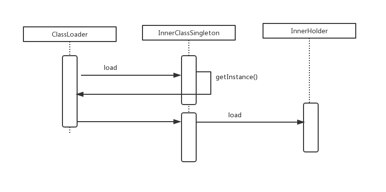

# 单例模式

标签： 设计模式

---

- [单例是什么](#单例是什么)
- [单例之路](#单例之路)
    - [饿汉式单例](#饿汉式单例)
    - [懒汉式单例](#懒汉式单例)
    - [破坏单例模式的情况](#破坏单例模式的情况)
    - [注册式单例](#注册式单例)
- 总结

---
## 单例是什么
> 单例是指在每次创建对象的时候，返回的都是同一个对象，而根据java创建对象的规则，当我们每次new出一个对象时，永远都是一个新的对象，所以需要通过一些方法来强制要求每次得到的对象是是一样的。

## 单例之路
### 饿汉式单例
饿汉式单例是指当类加载时，实例就已经创建.
```java
public class HungrySingleton {
    private HungrySingleton(){}
    private static final HungrySingleton hungrySingleton = new HungrySingleton();
    public static HungrySingleton getInstance(){
        return hungrySingleton;
    }
}
```
测试,这里采用两个线程的方式来进行验证单例模式。后面的几种单例也采用这样的形式。
```java
public static void main(String[] args) {
        Runnable r1 = () -> {
            HungrySingleton hungrySingleton = HungrySingleton.getInstance();
            System.out.println(String.format("thread[%s] hungrySingleton : %s",Thread.currentThread().getId(),hungrySingleton));
        };

        Runnable r2 = () -> {
            HungrySingleton hungrySingleton = HungrySingleton.getInstance();
            System.out.println(String.format("thread[%s] hungrySingleton : %s",Thread.currentThread().getId(),hungrySingleton));
        };

        new Thread(r1).start();
        new Thread(r2).start();
    }
```
从日志中可以看到，每次得到的实例都是相同的.
```java
thread[11] hungrySingleton : com.bingo.java.pattern.singletonpattern.HungrySingleton@5cbf235d
thread[12] hungrySingleton : com.bingo.java.pattern.singletonpattern.HungrySingleton@5cbf235d
```
### 懒汉式单例
懒汉式单例是指当实际要用到实例的时候，才开始初始化实例。
```java
public class LazySingleton {
    private LazySingleton() {
    }
    private static LazySingleton instance = null;


    /**
     * 使用的时候才开始创建对象，但是在多线程环境下，可能会出现创建多个实例或者实例覆盖的现象
     * @return
     */

    public static LazySingleton getInstance(){
        if(instance == null){
            instance = new LazySingleton();
        }
        return instance;
    }
```
如上所示，一个懒汉式单例就已经写完了，我们用多线程的方式运行一下，会发现有的时候，会得到两个不一样的对象地址。问题出在`getInstance()`方法，首先都会判断`instance==null`然后才开始创建对象,在多线程的环境下，如果第一个线程在正准本创建对象的时候被第二个线程抢去了cpu，那对第二个线程来说`instance==null`依然成立，所以会继续创建对象。instance是静态的，这种创建多次实例只有多个线程同时去`call getInstance()`才会发生，之后我们得到应该是最后一个获取cpu分片的线程创建的那个实例，因为后面的实例会覆盖前面的。所以如果不是在多线程使用，这种单例形式还是可以采取的。
>笔者之前被面试的时候有被要求手写一个单例模式，当时写的就是这种懒汉式单例，面试官会问，这种单例有什么缺点，如何改进？来，我们继续看……

饿汉式单例不会出现这种问题，是因为饿汉式单例在类加载的时候，实例就已经创建好了，问题出在我们在要用到实例的时候才对实例进行初始化，这个过程再多线程中会受到干扰，所以采用多线程同步的思路可以避免这个问题。
```java
/**
     * 在方法上 synchronized 关键字
     * @return
     */
    public synchronized static LazySingletonStrengthen1 getInstance() {
        if (instance == null) {
            instance = new LazySingletonStrengthen1();
        }
        return instance;
    }
```
和
```java
    /**
     * synchronized 语句块
     * double check
     * @return
     */
    public  static LazySingletonStrengthen2 getInstance() {
        if (instance == null) {
            synchronized (instance){
                if(instance == null){
                    instance = new LazySingletonStrengthen2();
                }
            }

        }
        return instance;
    }
```
 由于重复创建实例的原因是在创建的方法没有实例化，我们可以结合静态内部类来避免重复创建的问题。
 **内部类方式单例** [时序图](#附内部类单例模式的时序图)
```java
public class InnerClassSingleton {
    private InnerClassSingleton() {}

    public static InnerClassSingleton getInstance() {
        return InnerHolder.holder;
    }

    static class InnerHolder {
        static final InnerClassSingleton holder = new InnerClassSingleton();
    }
}
```
###破坏单例模式的情况
好了，到现在我们可以创建在正常环境下一个比较健壮的单例模式，但还是存在一些隐患，这些隐患来自与`反射`和`序列化和反序列化`。

**`1.1` 当有人恶意或者无意使用*反射*来创建我们的单例对象**
```java
        InnerClassSingleton innerClassSingleton1 = InnerClassSingleton.getInstance();
        System.out.println("innerClassSingleton1 " + innerClassSingleton1);
        Constructor constructor = InnerClassSingleton.class.getDeclaredConstructor(null);
        constructor.setAccessible(true);
        InnerClassSingleton innerClassSingleton2 = (InnerClassSingleton)constructor.newInstance();
        System.out.println("innerClassSingleton2 : "+innerClassSingleton2);
```
得到的结果是：
```java
innerClassSingleton1 com.bingo.java.pattern.singletonpattern.InnerClassSingleton@1540e19d
innerClassSingleton2 : com.bingo.java.pattern.singletonpattern.InnerClassSingleton@677327b6
```
**`1.2` 反单例解决方案**
虽然笔者觉得利用反射来破坏单例除了炫技之外意义不大，但是鉴于面试官可能会提及，所以应付面试还是准备一下。
首先分析反射破坏单例的原因，是因为反射的对象强行执行我们已经`private`化的无参构造方法，那我们在构造方法里面再追加一层判断
```java
    private InnerClassSingleton() {
        if(InnerHolder.holder!=null){
            throw new RuntimeException("该实例已经存在，单例模式下禁止创建多个实例");
        }
    }
```
**`2.1` 反序列化破坏单例**
> `Java` 提供了一种对象`序列化`的机制，该机制中，一个对象可以被表示为一个字节序列，该字节序列包括该对象的数据、有关对象的类型的信息和存储在对象中数据的类型。
将序列化对象写入文件之后，可以从文件中读取出来，并且对它进行`反序列化`，也就是说，对象的类型信息、对象的数据，还有对象中的数据类型可以用来在内存中新建对象。 

序列化对象需要对象所对应的类实现`Serializable`接口，这里将`InnerClassSingleton`扩展为`InnerClassSingletonSerializable`。
`public class InnerClassSingletonSerializable implements Serializable`
```java
    public static void main(String[] args) {
        InnerClassSingletonSerializable obj = InnerClassSingletonSerializable.getInstance();
        //这里直接是序列化到我指定的缓存数组中
        StringWriter StringWriter = new StringWriter();
        ByteArrayOutputStream baos = new ByteArrayOutputStream();
        try (ObjectOutputStream oos = new ObjectOutputStream(baos);) {
            oos.writeObject(obj);
        } catch (Exception e) {
            e.printStackTrace();
        }

        try (ByteArrayInputStream bais = new ByteArrayInputStream(baos.toByteArray());) {
            ObjectInputStream ois = new ObjectInputStream(bais);
            InnerClassSingletonSerializable obj1 = (InnerClassSingletonSerializable) ois.readObject();
            System.out.println(String.format("obj :" + obj));
            System.out.println(String.format("obj1 :" + obj1));
        } catch (IOException e) {
            e.printStackTrace();
        } catch (ClassNotFoundException e) {
            e.printStackTrace();
        }
    }
```
输出结果如下
```java
obj :com.bingo.java.pattern.singletonpattern.trouble.serializable.InnerClassSingletonSerializable@135fbaa4
obj1 :com.bingo.java.pattern.singletonpattern.trouble.serializable.InnerClassSingletonSerializable@5b480cf9
```
分析：第二次得到的对象来自`ObjectInputStream.readObject()`方法，一步步跟进`java`的源码，会发现这样一行代码
```java
obj = desc.isInstantiable() ? desc.newInstance() : null;
```
所以，它重新new了一个对象
**`2.2` 反序列化破坏单例解决方案**
在类中增加`readResolve()`方法，具体如下
```java
    public Object readResolve() {
        return instance;
    }
```
加了上面的方法后，再重新运行上面的main方法
```jvava
obj :com.bingo.java.pattern.singletonpattern.trouble.serializable.InnerClassSingletonSerializable@135fbaa4
obj1 :com.bingo.java.pattern.singletonpattern.trouble.serializable.InnerClassSingletonSerializable@135fbaa4
```
为什么？其实答案还是来自源码，在执行完`desc.newInstance()`之后，还有这样一行代码
```java
        ...
        if (obj != null &&
            handles.lookupException(passHandle) == null &&
            desc.hasReadResolveMethod())
        {
            Object rep = desc.invokeReadResolve(obj);
        ...
```
`hasReadResolveMethod()`判断`readResolve()`方法是否存在,`desc.invokeReadResolve(obj)`顾名思义便是触发`readSolve()`方法。

### 注册式单例
注册是指枚举式单例或容器式单例，来看看它们的代码实现
```java
public enum EnumSingleton {
    INSTANCE;

    private Object obj ;

    public Object getObj() {
        return obj;
    }

    public void setObj(Object obj) {
        if(this.obj==null){
            this.obj = obj;
        }else{
            throw new RuntimeException("Cannot call this method when obj was existed");
        }
    }
    public static EnumSingleton getInstance(){
        return INSTANCE;
    }
}
```
```java
public class ContainerSingleton {
    private static final Map<String,Object> container = new HashMap<String,Object>();

    /**
     * 如果需要线程安全，记得使用synchronized关键字
     * @param className
     * @return
     */
    public static Object getInstance(String className){
        try {
            if(!container.containsKey(className)){
                Class clazz = Class.forName(className);
                Object obj = clazz.newInstance();
                container.put(className,obj);
            }
        } catch (ClassNotFoundException e) {
            e.printStackTrace();
        } catch (IllegalAccessException e) {
            e.printStackTrace();
        } catch (InstantiationException e) {
            e.printStackTrace();
        }

        return container.get(className);
    }

}
```

### 总结
形式  |优点|缺点
----|----|----
饿汉式单例   |不用考虑多线程问题 |类加载阶段就开始初始化，可能占用不必要的资源；可以被反射破坏；可以被反序列化破坏
懒汉式单例  |第一次获取实例的时候才开始初始化 |多线程环境下需要进行加锁设置；可以被反射破坏；可以被反序列化破坏
内部类单例  |不用考虑多线程问题；节省加载阶段的资源空间 |多出一个类；可以被反序列化破坏
注册式单例  |不用考虑多线程问题，同时不用担心反射破坏单例，其中枚举式单例自带解决发序列化问题的方案 | 属于懒汉式单例

**破坏单例的方式：**
1. 多线程
2. 反射
3. 反序列化

###### 附内部类单例模式的时序图

