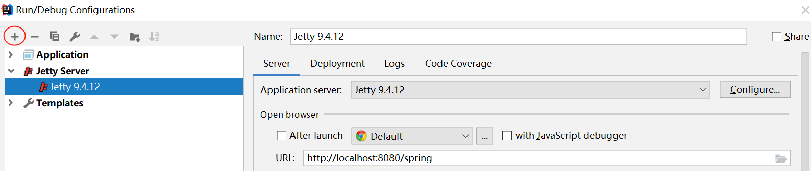

# Mini SpringMVC

Mini SpringMVC 需要实现的功能

* 根据配置扫描entity
* 依赖注入
* 访问地址与controller方法绑定

简单就是模拟springMVC，减少传统的web.xml大量的servlet-mapping 配置，只配置一个负责分发的servlet。

模拟SpringMVC简单功能实现，需要当前工程为一个web工程，就是让项目在web容器中
intellJ 配置web项目

## 准备工作
`1` 增加servlet的依赖
```xml
<dependency>
    <groupId>javax.servlet</groupId>
    <artifactId>servlet-api</artifactId>
    <version>2.4</version>
    <scope>provided</scope>
</dependency>
```
`2` Intellj web环境配置
1. File->Settings->Build,Execution,Deployment->Application Servers


2. File->Project Structure->Project Modules
选择我们要增加web环境的project,点击上方的`+`添加,在弹出的下拉列表中找到`web`,

3. File->Project Structure->Artifacts
接着第二步，选到Artifacts

图中标记的bingo就是服务启动后，项目访问的root，`http://localhost:8080/bingo`

4. Run->Edit Configurations

添加web server


在server上添加我们指定的project(其实就是第三步中的Artifact)


## 代码实现
